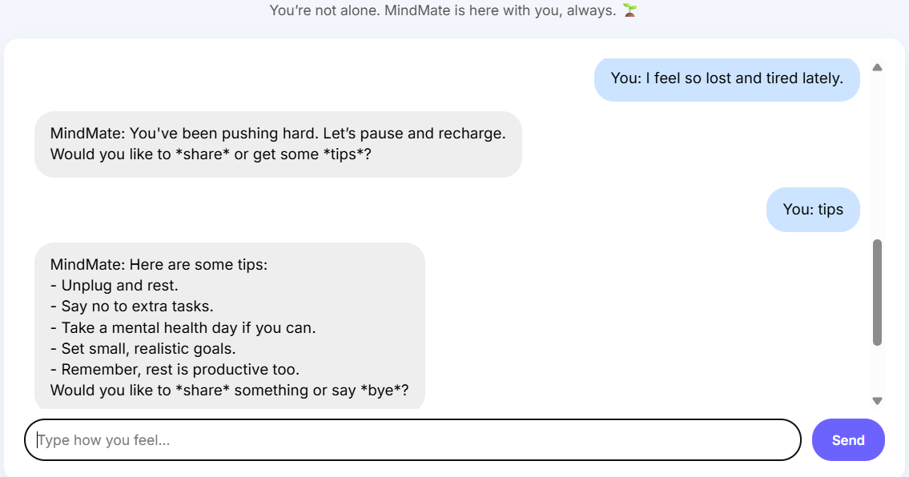
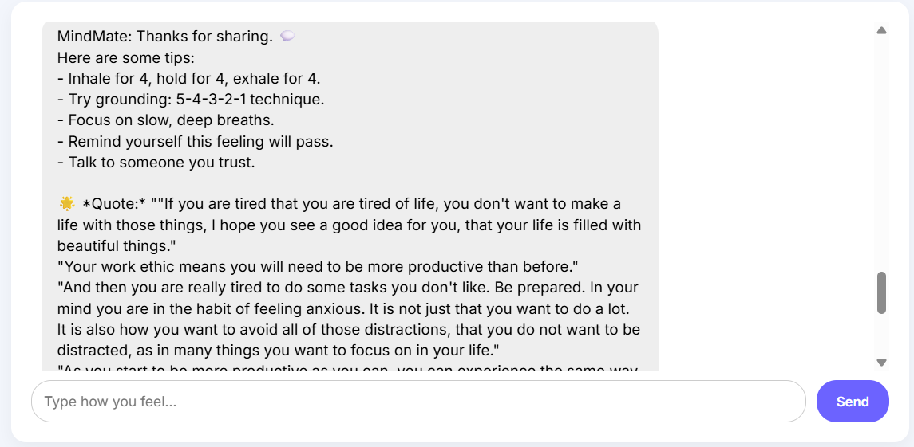

# 🧠 MindMate – Mental Wellness Chatbot

> Empowering emotional well-being through AI-driven conversation.  
---

## 🌟 Overview

**MindMate** is a personalized mental wellness chatbot designed to detect user emotions in real-time using advanced **NLP** models and respond empathetically using **Generative AI**. It supports emotion tracking, motivational quotes, coping tips, and emotion visualizations.

---

## 🧠 Features

- 🤖 **Emotion Detection** using HuggingFace BERT (`nateraw/bert-base-uncased-emotion`)
- 💬 **Empathetic Responses** powered by emotion maps and GenAI-driven reply logic
- ✨ **Motivational Quote Generation** using `distilgpt2` via HuggingFace `text-generation`
- 🧾 **Session-based chat logging** with MySQL
- 📊 **Emotion Frequency Visualizations** using Matplotlib
- 🧘‍♀️ **Tips and Support Guidance** based on detected emotion
- 🎨 Beautiful and responsive web UI (HTML + CSS)

---

## 🖼️ Screenshots

### 💬 1. Chat Interface – Emotion Detection


### 🎭 2. Detected Emotion: lone and tired




### 🔥 3. Detected Emotion: anxious


### 📊 4. Emotion Frequency Chart


---

## 📦 Installation & Setup

> Follow these steps to set up and run MindMate on any machine (Windows/Linux/Mac).

### 1. 📁 Clone the Repository

```bash
git clone https://github.com/yourusername/mindmate.git
cd mindmate
```
### 2. Create and Activate Virtual Environment (Recommended)
```bash
python -m venv venv
venv\Scripts\activate     # For Windows
# OR
source venv/bin/activate  # For Linux/macOS
```
### 3. Install Dependencies
```bash
pip install -r requirements.txt
```
### 4. Set Up the MySQL Database
```bash
CREATE DATABASE mindmate;
USE mindmate;
SOURCE schema.sql;
```
### 5. Configure Database Credentials
```bash
conn = mysql.connector.connect(
    host="localhost",
    user="your_mysql_username",
    password="your_mysql_password",
    database="mindmate"
)
```
### 6. Run the Application
```bash
python app.py
```
